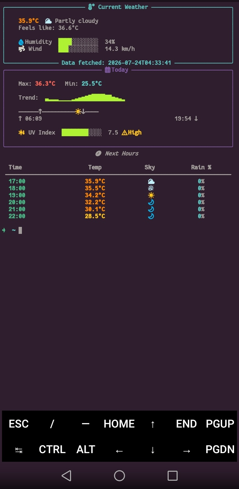

# WeatherCLI

A beautiful terminal weather dashboard built with Python and Rich.



## Features

- Current weather (temperature, feels like, humidity, wind)
- Sunrise & sunset with a 24-hour day-position bar
- UV Index with a color-coded safety level
- Hourly forecast table
- Temperature trend sparkline
- Nerd Font icons and colored gauges
- Optional hourly Android notifications (Termux:API)
- Built for Termux (Android), but works anywhere Python 3 runs

## How it works

The project is split into small, independent scripts:

- **`weather.py`** — fetches a full day's forecast from [Open-Meteo](https://open-meteo.com/) (free, no API key needed) and saves it to `data.json`. Only needs to run once a day.
- **`dashboard.py`** — reads `data.json` and displays it. Safe to run any time; it always computes the current hour's conditions from the saved forecast.
- **`notify.py`** — sends an Android notification with the current conditions. Optional, requires Termux:API.

## Setup

1. Clone the repo and install dependencies:

```bash
git clone <repo-url>
cd Weather
pip install -r requirements.txt
```

2. Create a `config.py` file with your location (this file is gitignored, so your coordinates never get committed):

```python
LATITUDE = 30.0444
LONGITUDE = 31.2357
```

3. Fetch today's weather data:

```bash
python weather.py
```

4. Display the dashboard:

```bash
python dashboard.py
```

## Optional: hourly notifications

Requires the **Termux:API** app (from F-Droid) and package:

```bash
pkg install termux-api
python notify.py
```

## Optional: run it automatically

`weather.py` only needs to run once a day; `notify.py` can run every hour on its own using Termux's built-in job scheduler — no need to keep Termux open:

```bash
pkg install termux-job-scheduler
chmod +x run_weather.sh run_notify.sh

termux-job-scheduler -s $HOME/Weather/run_weather.sh --job-id 1 --period-ms 86400000 --persisted true
termux-job-scheduler -s $HOME/Weather/run_notify.sh --job-id 2 --period-ms 3600000 --persisted true
```

## Project structure

```
Weather/
├── weather.py        # fetches & saves the daily forecast
├── dashboard.py       # displays the terminal dashboard
├── notify.py          # sends hourly notifications
├── config.py           # your location (gitignored, not committed)
├── run_weather.sh      # wrapper script for job scheduling
├── run_notify.sh        # wrapper script for job scheduling
└── requirements.txt
```

## Requirements

- Python 3
- [rich](https://github.com/Textualize/rich)
- A Nerd Font in your terminal (so the icons render correctly)
- Termux:API (optional, for notifications)

